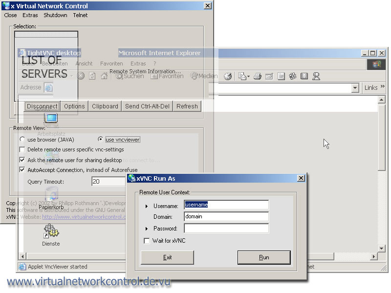



## xVNC is a remote desktop viewer without installation on client for nt/xp/2k

### Description

xVNC (GPL License) is an extension to TightVNC in vb6 visual basic that copies, installs, configures and executes and also removes the vnc system on/from a remote machine. Access to domain administrators and limited to local machine, imports reg-files to remote registry silently, lists all viewable nt clients/servers in workgroup/domain, runas included.

please vote and give feedback if this is the tool you are looking for. Complete Open Source with CVS...
 
### More Info
 

             |
---                |---
**Submitted On**   |
**By**             |[preneco](https://github.com/Planet-Source-Code/PSCIndex/blob/master/ByAuthor/preneco.md)
**Level**          |Advanced
**User Rating**    |5.0 (60 globes from 12 users)
**Compatibility**  |VB 6\.0
**Category**       |[Windows System Services](https://github.com/Planet-Source-Code/PSCIndex/blob/master/ByCategory/windows-system-services__1-35.md)
**World**          |[Visual Basic](https://github.com/Planet-Source-Code/PSCIndex/blob/master/ByWorld/visual-basic.md)
**Archive File**   |

### Source Code

<html><body>

<a href="http://prdownloads.sourceforge.net/xvnc/xvnc_win32_src_v02.zip?download"><b></b></a><b><a href="http://prdownloads.sourceforge.net/xvnc/xvnc_win32_src_v02.zip?download" target="_blank">Download
 new Release Stable V02</a></b>

Sorry I couldn't
 upload the source up to Pscode.com 
 so if you want the documentation please visit: <a href='http://www.virtualnetworkcontrol.de.vu' target="_blank"> 
 <b>Project Home Page</b></a> or <a href='https://sourceforge.net/project/showfiles.php?group_id=63121' target="_blank"><b>Source
 Code and Installer</b></a> 

<ul>
 <li>xvnc is an
 application for win-nt based networks including tcp/ip.</li>
 <li>it's like a
 remote installer and executor of tightvnc(search at sourfeforge for that tool)
 for nt/2k/xp machines.</li>
 <li>it automatically
 shows all available servers in your domain or workgroup and gives</li>
 <li>the administrator
 the privilege to install, configure and start the tightvnc system on a remote
 machine.</li>
 <li>after the remote
 session the tightvnc system will be removed from the remote system.</li>
 <li>also remote
 registry import is provided.</li>
 <li>you can run
 the application as another user on the local machine.</li>
 <li>the remote
 user will optionally be asked for access if it's no server or to delete the
 local vnc settings if it is installed yet.</li>
 <li>the application
 uses a random password that is automatically 3des encrypted to view the remote
 pc without any password input for the user.</li>
 <li>the tool is
 just an extension to tightvnc 1.2.6 or any later version and is provided to
 system/domain administrators and limited to the machine the installation comes
 from (so that no other can share the session or read the password remotely)</li>
</ul>
</body>
</html>

